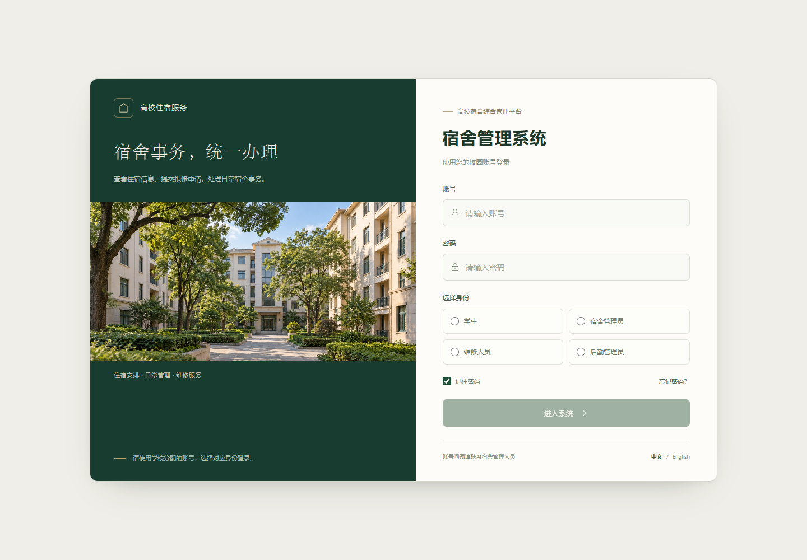
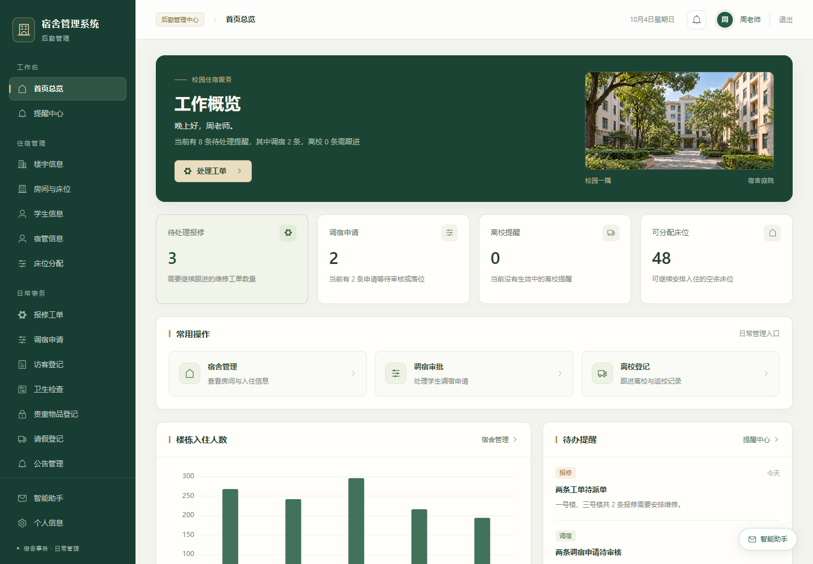

# 宿舍管理系统 · 前端

面向高校住宿管理的 Web 前端，基于 **Vue 3 + Element Plus**，配套 **Spring Boot 后端**。学生、宿舍管理员、维修人员和后勤管理员通过各自的工作台处理住宿、报修、调宿及日常事务。

界面采用深绿色、暖白色与校园照片，统一了导航、表格、表单和弹窗样式，并适配桌面及移动端。登录页支持中文与英文切换。

**本仓库仅包含前端代码和静态素材。** Java 后端、数据库脚本和用户上传的业务附件不在本仓库中；真实登录和业务操作需要连接配套后端。

## 完整项目购买

**完整项目代码请添加本人微信购买。** 扫描下方二维码添加好友，联系购买完整项目。


## 界面预览

### 登录页



### 后勤管理首页



截图中的姓名、人数和待办事项为界面预览样例，不代表真实业务数据。

## 功能与角色

| 角色 | 主要功能 |
| --- | --- |
| 学生 | 查看住宿信息、提交报修、跟踪维修并评价、申请调宿、离校申请与返校确认、查看宿舍卫生记录 |
| 宿舍管理员 | 楼宇与房间管理、学生信息、报修工单、调宿处理、访客登记、卫生检查、贵重物品登记、请假登记、待办提醒 |
| 维修人员 | 查看待认领及本人负责的工单、接单、预约上门、提交完工记录、查看维修评价 |
| 后勤管理员 | 宿舍管理员的管理功能，以及宿管信息维护、床位分配、公告管理 |

主要模块包括：

- **首页总览**：按角色展示常用入口、待办事项、住宿或维修概况；管理端提供楼栋入住人数图表。
- **住宿管理**：楼宇、房间、床位、学生和宿管信息维护，床位分配中心。
- **报修流程**：学生提交申请，管理端派单，维修人员接单、预约和完工，学生确认与评价。
- **申请与登记**：调宿、离校与返校、请假、访客、贵重物品及卫生检查。
- **公告与提醒**：公告发布和查看、管理端待办提醒。
- **个人服务**：各角色查看个人资料；学生、宿舍管理员与后勤管理员可维护资料、上传头像及修改密码。
- **智能助手**：宿舍业务咨询、相关页面入口和天气查询；业务回答需要后端接口支持。

菜单和页面入口按角色区分，业务数据和操作权限由配套后端处理。

## 技术栈

| 技术 | 用途 |
| --- | --- |
| Vue 3 | 页面与组件 |
| Element Plus | 表单、表格、弹窗等界面组件 |
| Vue Router 4 | 页面路由 |
| Vuex 4 | 状态管理 |
| Axios | HTTP 请求与统一响应处理 |
| ECharts 5 | 数据图表 |
| wangEditor 4 | 公告富文本编辑 |
| Vue CLI 4 / Webpack 4 | 开发服务器与构建 |

具体依赖版本见 [package.json](package.json)，安装版本由 `package-lock.json` 锁定。

## 本地运行

本地已验证环境：**Node.js 22.16.0、npm 11.13.0**。现有构建工具使用 Webpack 4，在该环境下启动和打包时需要设置 `NODE_OPTIONS=--openssl-legacy-provider`。

### 1. 下载并安装依赖

```sh
git clone https://github.com/yifan-kevin/dormitory-frontend.git
cd dormitory-frontend
npm ci
```

所有 npm 命令都应在包含 `package.json` 的前端根目录执行。若使用完整项目目录，前端位于其中的 `vue` 文件夹。

### 2. 启动开发服务器

Windows PowerShell：

```powershell
$env:NODE_OPTIONS = "--openssl-legacy-provider"
npm run serve -- --port 8081
```

Windows CMD：

```bat
set NODE_OPTIONS=--openssl-legacy-provider
npm run serve -- --port 8081
```

macOS / Linux：

```sh
NODE_OPTIONS=--openssl-legacy-provider npm run serve -- --port 8081
```

启动后访问 <http://localhost:8081/Login>。如果 8081 已被占用，以终端实际输出的地址为准。

### 3. 连接后端

默认请求链路为：

```text
浏览器请求 /api/* → 前端开发代理 → http://localhost:9090/*
```

在 [vue.config.js](vue.config.js) 中修改 `devServer.proxy["/api"].target`，即可指向实际的后端地址。代理会移除 `/api` 前缀，例如 `/api/stu/login` 转发到后端的 `/stu/login`。

统一请求配置位于 [src/utils/request.js](src/utils/request.js)，`baseURL` 为 `/api`；使用该请求实例时，业务接口路径无需再次添加 `/api`。

登录页的四种身份对应后端的 `stu`、`dormManager`、`worker`、`admin` 登录接口。账号由配套后端提供，没有内置的离线演示登录。后端未启动时可以查看登录界面，登录与数据操作需等待后端可用。

## 构建与部署

### 生产构建

在 PowerShell 中执行：

```powershell
$env:NODE_OPTIONS = "--openssl-legacy-provider"
npm run build
```

CMD 中执行：

```bat
set NODE_OPTIONS=--openssl-legacy-provider
npm run build
```

macOS / Linux 中执行：

```sh
NODE_OPTIONS=--openssl-legacy-provider npm run build
```

生成的 `dist/` 目录可交给 Nginx 等静态服务器托管。开发服务器的代理配置不会随构建产物发布，生产环境需要单独配置 `/api/` 转发。

### Nginx 配置示例

以下示例按站点根路径部署，静态目录及后端地址请替换为实际值：

```nginx
server {
    listen 80;
    server_name localhost;
    root /var/www/dormitory-frontend/dist;
    index index.html;

    location /api/ {
        proxy_pass http://127.0.0.1:9090/;
        proxy_set_header Host $host;
        proxy_set_header X-Real-IP $remote_addr;
    }

    location / {
        try_files $uri $uri/ /index.html;
    }
}
```

路由使用 History 模式，`try_files` 用于让刷新 `/Login`、`/home` 等页面时返回前端入口。`proxy_pass` 末尾的 `/` 用于移除转发路径中的 `/api/` 前缀。

当前静态图片引用 `/images/...`，建议部署在站点根路径。若改为子目录部署，需要同时调整静态素材路径、`publicPath` 和路由基础路径。

## 目录结构

```text
dormitory-frontend/
├── docs/images/          # README 截图与微信二维码
├── public/
│   ├── images/           # 校园展示图片
│   └── favicon.svg      # 浏览器图标
├── src/
│   ├── assets/css/      # 全局与页面样式
│   ├── assets/js/       # 页面业务逻辑
│   ├── components/      # 导航、图表、助手等组件
│   ├── layout/          # 应用布局
│   ├── router/          # 路由与角色入口
│   ├── store/           # 状态管理
│   ├── utils/request.js # Axios 请求配置
│   ├── views/           # 业务页面
│   └── main.js          # 应用入口
├── GENERATED_ASSETS.md  # 生成图片记录与提示词
├── package.json
├── package-lock.json
└── vue.config.js        # 构建与开发代理配置
```

## 常见问题

| 现象 | 处理方式 |
| --- | --- |
| `ENOENT: ... package.json` | 当前目录不正确，进入包含 `package.json` 的前端目录；Windows CMD 跨盘切换使用 `cd /d 路径` |
| `ERR_OSSL_EVP_UNSUPPORTED` | 按上方示例，在当前终端设置 `NODE_OPTIONS=--openssl-legacy-provider` 后重新启动或构建 |
| 登录失败或 `/api` 请求报连接错误 | 确认配套后端已启动、代理地址及端口正确、账号与所选身份对应 |
| 部署后接口返回 404 | 在生产服务器配置 `/api/` 反向代理，开发环境的 `devServer.proxy` 不会自动用于生产环境 |
| 刷新业务页面返回 404 | 配置 History 路由回退，将前端页面请求交给 `index.html` |

## 图片素材

五张校园展示图片为生成的虚构校园场景。文件用途、生成时间及完整提示词见 [GENERATED_ASSETS.md](GENERATED_ASSETS.md)。账户头像和业务附件由用户上传接口提供，不属于这组静态素材。
